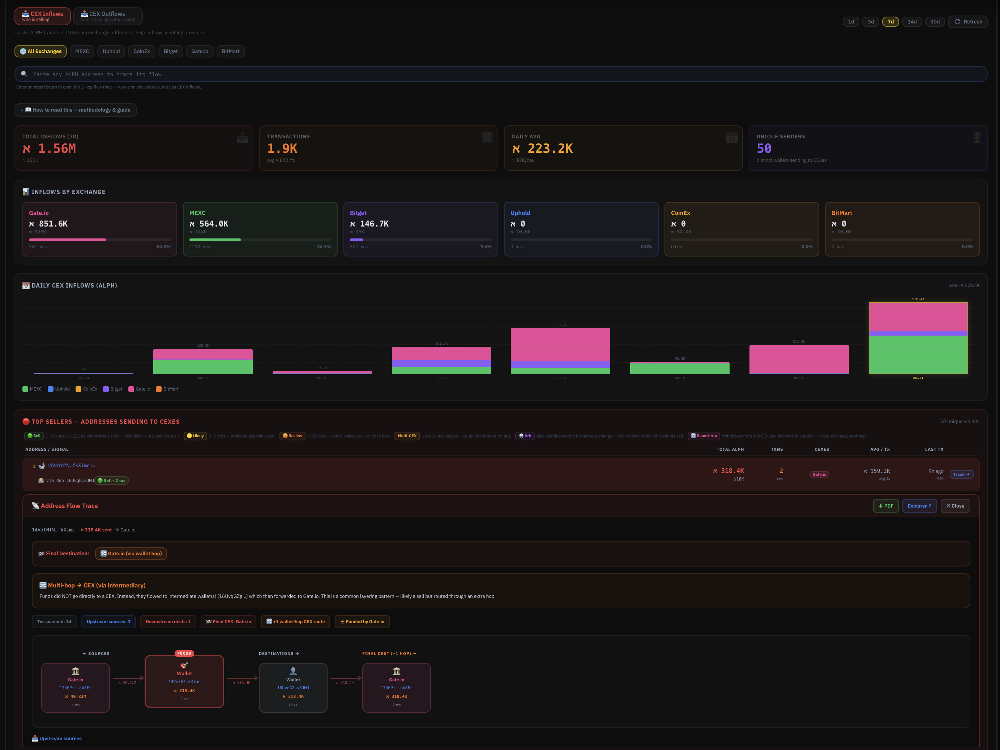

# CEX Flow

Tracks real-time movement of ALPH between the Alephium network and centralized exchange hot wallets.

<figure><figcaption></figcaption></figure>

***

### Key Features

* Total inflows and outflows
* Breakdown by individual exchange
* Daily inflow charts
* Top addresses sending funds to CEXs
* Multi-hop transaction tracing
* Ability to paste any address and follow its flow

This module is essential for monitoring potential selling pressure and understanding capital rotation between on-chain and off-chain venues.
