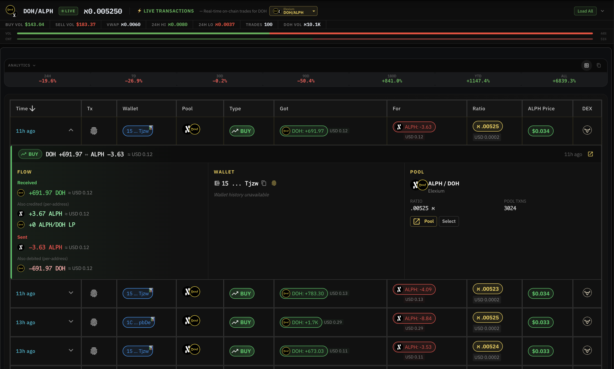
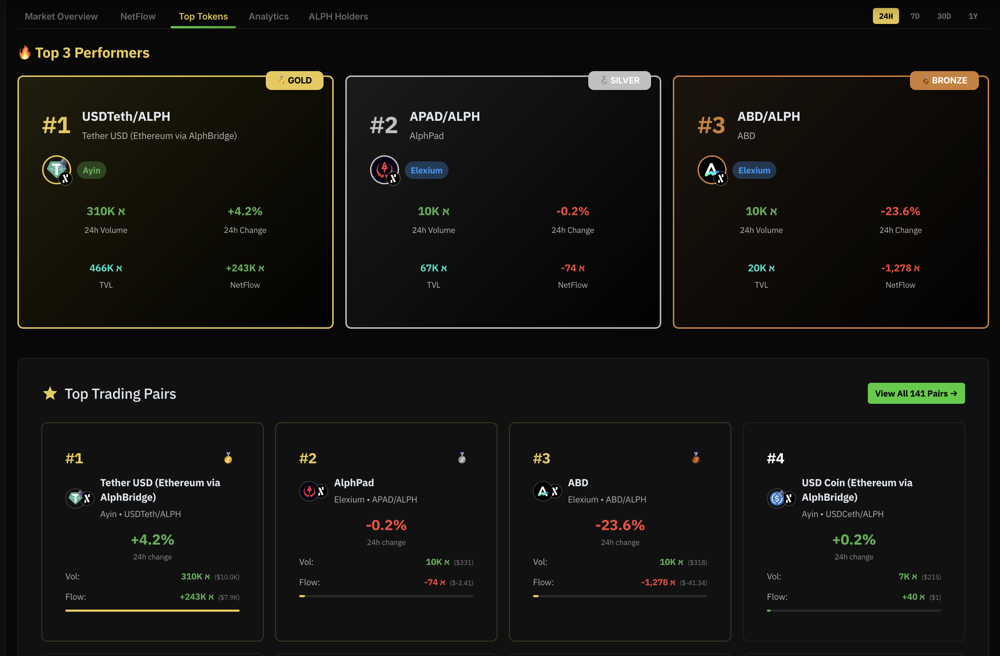

# Global & Transactions

This section gives you both ecosystem-wide intelligence and granular trade-level visibility.

***

### Global View

The Global tab provides a high-level snapshot of the entire Alephium DEX ecosystem:

* Total volume and netflow
* Top 3 Performers (Gold / Silver / Bronze cards)
* Top Trading Pairs
* Top Performers and Top Decliners (24h)
* Volume Leaders
* Ecosystem Pressure (Buy vs Sell ratio)
* Live Whale Activity feed

It serves as the command center for understanding market-wide sentiment and capital movement.

<figure><figcaption></figcaption></figure>

***

### Transactions View

The Transactions tab delivers a real-time feed of on-chain trades with powerful context:

* Live trade stream (timestamp, wallet, pool, side, amounts, price)
* Expandable trade details
* Whale trade highlighting
* Progressive loading of full historical trades
* One-click transition into Wallet Tracker by clicking any address

This combination of macro overview and micro-level trade data makes the Global & Transactions section extremely effective for both monitoring and investigation.

<figure><figcaption></figcaption></figure>
