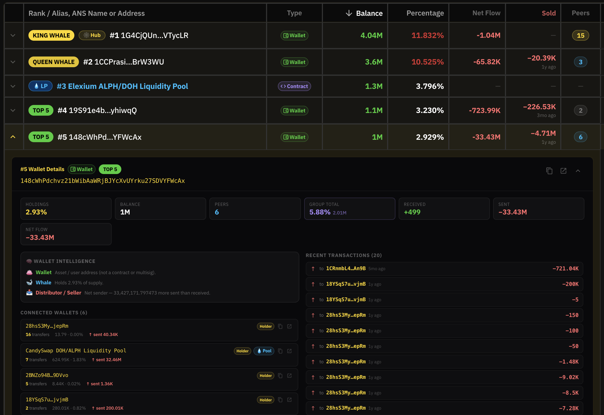
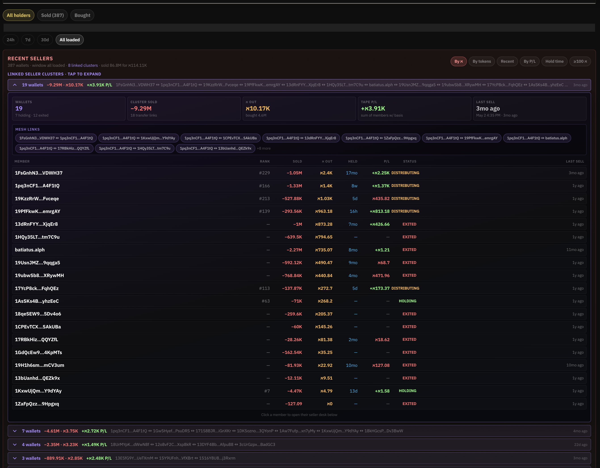
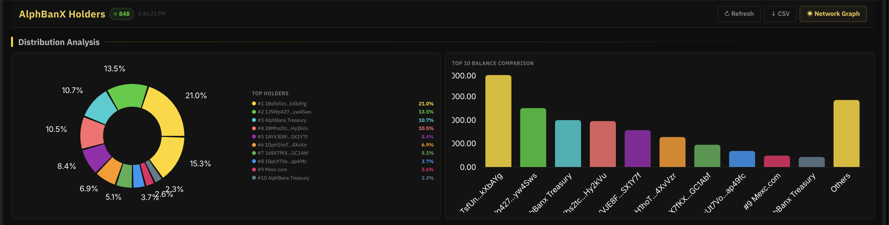
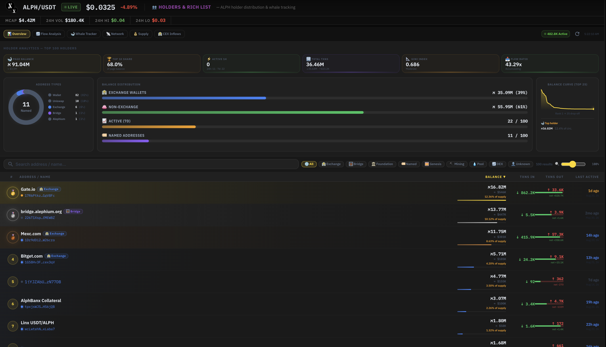
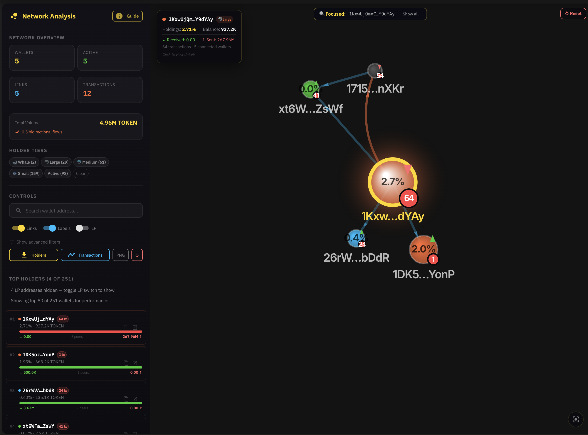

# Holders & Clusters

One of the most powerful features of the Alephium Dex Screener.

<figure><figcaption></figcaption></figure>

<figure><figcaption></figcaption></figure>

***

### Distribution Analysis

* Visual pie chart of holder concentration
* Top 10 balance comparison
* Clear ownership percentage breakdown

<figure><figcaption></figcaption></figure>

***

### Rich List

Fully sortable holder table including:

* Rank, Alias, or ANS name
* Wallet vs Contract labels
* Balance and % of supply
* Net Flow
* Amount Sold
* Number of linked peers
* Group Total (cluster size)

Special tags include King Whale, Queen Whale, Dolphin, LP, and Hub wallets.

<figure><figcaption></figcaption></figure>

***

### Linked Seller Clusters (Spider Tracking)

Automatically detects groups of related wallets and reveals:

* Coordinated selling activity
* Combined cluster P\&L
* Linked addresses (network / spider view)
* Potential shared funding sources or wash activity

This cluster intelligence is extremely valuable for identifying hidden relationships between wallets.

<figure><figcaption></figcaption></figure>
