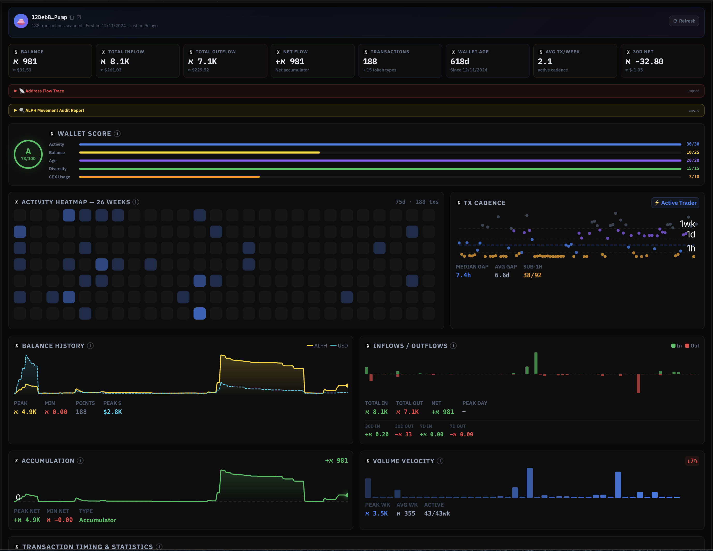
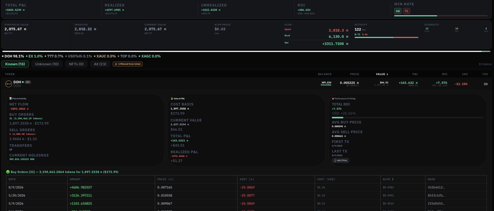

# Wallet Tracker & Portfolio

The most advanced wallet intelligence tool in the Alephium ecosystem. [https://app.doh.money/alephium?tab=explorer](https://app.doh.money/alephium?tab=explorer)

<figure><figcaption></figcaption></figure>

***

### Overview Metrics

* Current Balance
* Total Inflow / Outflow / Net Flow
* Transaction count & wallet age
* Activity cadence

***

### Performance Analytics

* Realized & Unrealized P\&L
* Total ROI
* Win Rate
* Max Drawdown
* Profit Factor
* Average Win / Loss

***

### Portfolio Intelligence

* Full token holdings with current value
* Cost basis tracking
* Per-token P\&L and ROI
* Portfolio composition

<figure><figcaption></figcaption></figure>

***

### Behavioral Analysis

* Activity Heatmap
* Transaction Cadence
* Dormancy detection
* Holding Period Analysis (FIFO)
* Transfer size distribution
* Counterparty analysis
* Wallet behavioral scoring

***

### Export & Reporting

* PDF report
* HTML report
* CSV / JSON export

The Wallet Tracker turns any Alephium address into a fully transparent performance and behavior profile.
