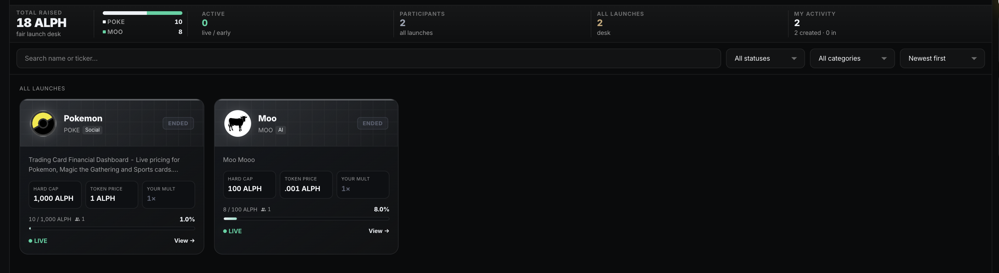
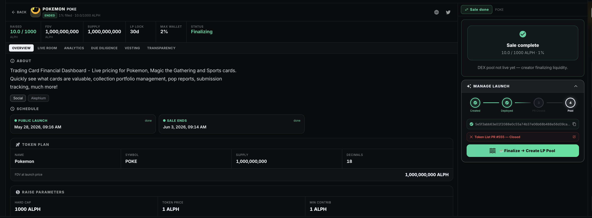

# Launchpad

The DOH Launchpad is a fair and transparent token launch platform built natively into the DOH DEX on Alephium.

It allows projects to raise capital in ALPH while giving participants a clean, tier-based experience with clear rules and real-time visibility.

<figure><figcaption></figcaption></figure>

***

### Key Features

* **Browse Launches** — View all live, upcoming, and completed launches
* **Featured Spotlight** — Highlighted live launches at the top
* **Advanced Filtering & Sorting** — Search by name/ticker, filter by status or category, sort by newest, ending soon, most raised, popularity, or fill percentage
* **My Launches** — Track launches you created or participated in
* **Tier System** — Higher staking tiers unlock earlier access and higher commit caps
* **Leaderboard** — Top launches ranked by capital raised, fill rate, and participants
* **Create Launch Wizard** — Permissionless launch creation with guided steps

<figure><figcaption></figcaption></figure>

***

### How Participation Works

1. **Browse** — Discover live and upcoming sales
2. **Commit** — Lock ALPH during the sale window
3. **Claim** — Receive tokens after the launch is finalized

***

### Tier Benefits

Your staking tier determines:

* Access timing (earlier entry for higher tiers)
* Maximum commit size
* Allocation priority

Stake $DOH to improve your tier and unlock better launch conditions.

***

### Launch Stats

Real-time metrics displayed across the Launchpad:

* Number of active launches
* Total capital raised
* Total participants
* Individual launch progress and fill percentage

***

### Design Philosophy

The Launchpad prioritizes fairness, transparency, and clarity. Every launch shows real-time raised amounts, participant counts, status, and clear timelines — so both projects and participants know exactly where they stand.
