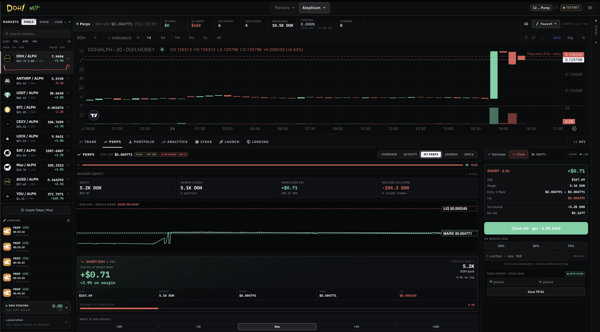
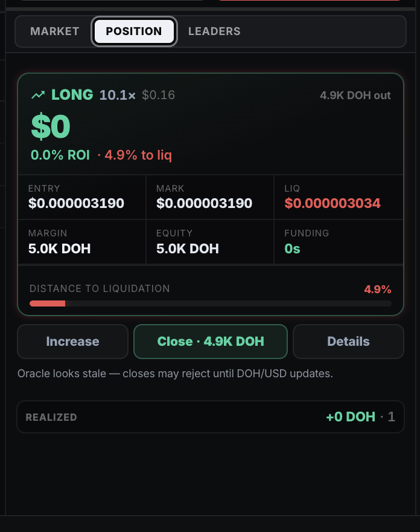

# Perpetual Futures

DOH Perpetual Futures allow traders to go long or short on Alephium assets with leverage, using an isolated margin system.

<figure><figcaption></figcaption></figure>

***

### Key Features

* **Isolated Margin** — Risk is limited to the margin allocated to each position
* **Leverage** — Up to 10x
* **Real-time Mark Price**
* **Funding Rates** — Periodic payments between long and short positions
* **Clear Liquidation Price** displayed before and after entry
* **Partial and Full Close** support
* Transparent fee structure

<figure><figcaption></figcaption></figure>

***

### Risk Management

Every position shows:

* Entry price
* Liquidation price
* Current unrealized P\&L
* Margin used
* Funding payments

The interface is designed to make risk parameters visible and understandable at all times.

***

### Trading Experience

Perpetual Futures are fully integrated into the DOH DEX terminal, sharing the same professional charting, order entry, and portfolio tools as Spot trading.

This creates a unified experience for both spot and leveraged trading on Alephium.
