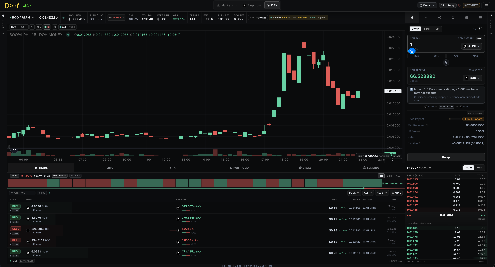

# Spot Trading

Market Swaps

Execute instant swaps against on-chain liquidity pools.

* Dynamic fee structure
* Real-time price impact calculation
* Minimum received protection
* Support for multiple pools per pair

<figure><figcaption></figcaption></figure>

### Limit Orders

Place orders at your desired price instead of taking the current market rate. Ideal for precise entries and exits.

### Liquidity Provision

Become a liquidity provider and earn a share of trading fees.

* Add or remove liquidity
* View your current LP positions and performance
* Track fees earned in real time

### Create Token or Pool

Anyone can create a new token and/or liquidity pool permissionlessly directly from the interface.
