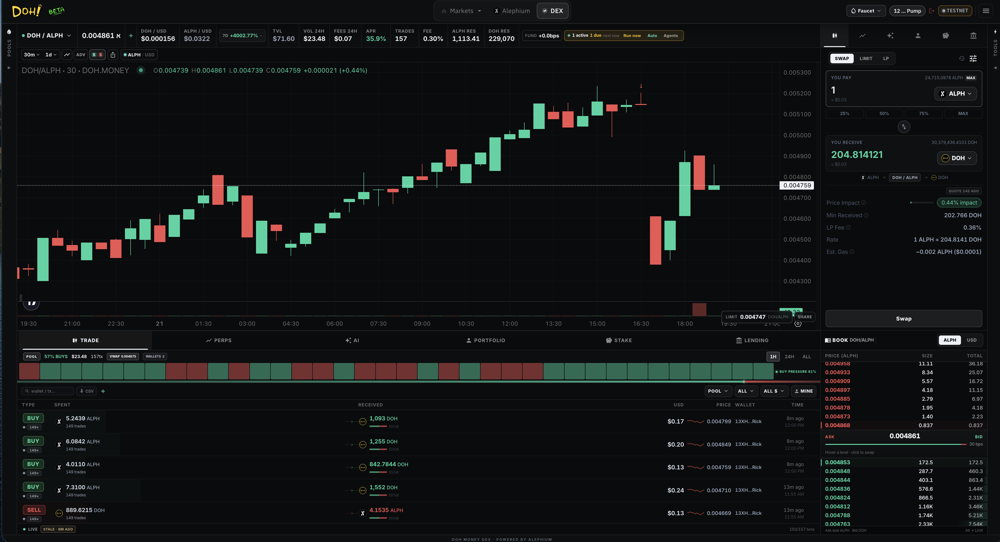

# DOH DEX Overview

The DOH DEX is a full-featured decentralized exchange built natively on Alephium.

It combines classic AMM spot trading with perpetual futures, a token launchpad, staking, and advanced portfolio tools — all inside a professional trading terminal interface.

<figure><figcaption></figcaption></figure>

### Desktop Layout

* **Left Panel**: Market list, search, favorites, and pool creation
* **Center Panel**: Advanced charting, trading ticket, activity feed, and portfolio
* **Right Panel**: Tools, open positions, AI insights, and customizable widgets

### Core Modules

* Spot Trading (Market + Limit)
* Liquidity Provision
* Perpetual Futures
* Staking
* Token Launchpad
* Portfolio Tracker
* AI Market Insights

The DEX is designed to feel as close as possible to a centralized exchange while remaining fully non-custodial and transparent.
