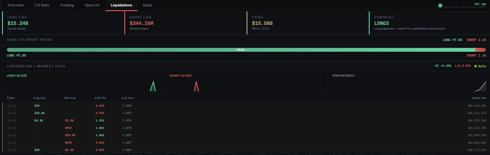

# Arbitrage & Futures

### Cross-Exchange Arbitrage

* Live spread scanner across 22 exchanges
* Net profit estimation after fees and slippage
* Opportunity ranking and filtering

### Futures Data

* Funding rates across major exchanges (Bybit, OKX, Gate, Binance, etc.)
* Open Interest tracking
* Funding arbitrage opportunities
* Real-time updates

This section is tightly integrated with the dedicated Arbitrage Dashboard for deeper simulation and execution planning.

<figure><figcaption></figcaption></figure>
