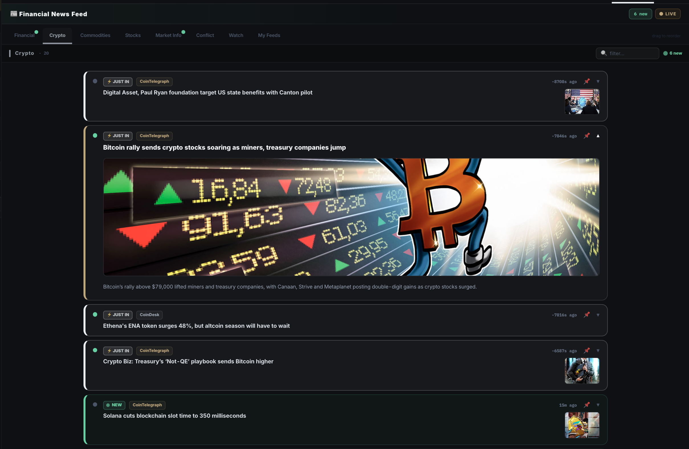
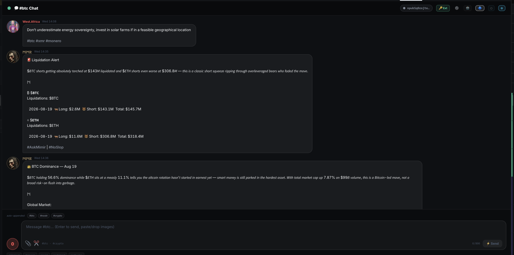

# News, Social & Sidebar

### Real-Time News Feed

* Continuously updated financial and crypto news
* Categorized by impact (macro, crypto-specific, regulatory, etc.)
* Designed to surface information that can move markets quickly

<figure><figcaption></figcaption></figure>

### Social Intelligence

* **Nostr Feed** — Decentralized crypto social timeline + per-token chatrooms
* **X / Twitter Feeds** — Multi-column or merged timeline of high-signal accounts
* Real-time updates so you never miss emerging narratives

<figure><figcaption></figcaption></figure>

### TV Tab

* CryptoWatch YouTube video feed
* Full-screen TradingView chart mode

<figure><figcaption></figcaption></figure>

### Fully Customizable Sidebar

12 independently collapsible and drag-to-reorder sections, including:

* Live TV
* Token Favorites rotator
* Rug Alerts
* Token Details
* Market Pulse
* Futures
* Fear & Greed
* Top Movers
* Latest News
* X Feeds
* Market Hours
* Arbitrage

You can place the sidebar on the right or left and fully personalize your workspace.
